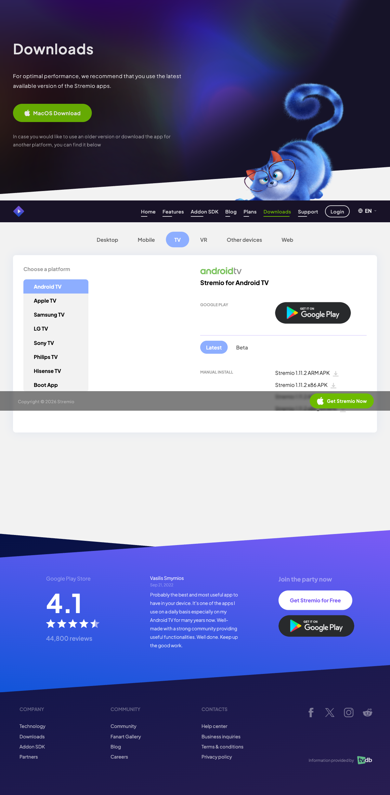
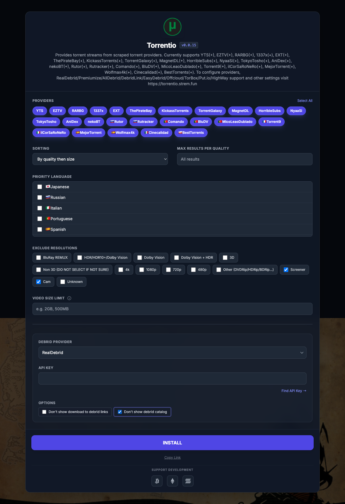
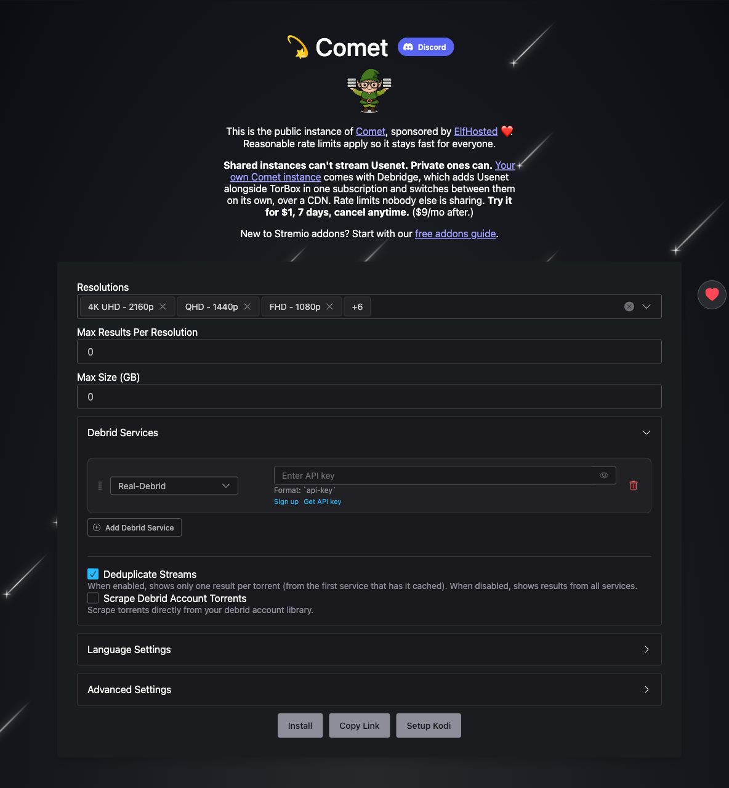

# Stremio + Real-Debrid Setup Guide

A step-by-step guide to set up Stremio with Real-Debrid for high-quality, cached streaming. The approach: configure everything once on the **macOS app or web portal** while signed in to your Stremio account, and all your addons sync automatically to every other device (phone, TV, etc.).

## Contents

- [Addons used](#addons-used)
- [What the pieces do](#what-the-pieces-do)
- [Step 1 — Create a Real-Debrid account](#step-1--create-a-real-debrid-account)
- [Step 2 — Set up Stremio (macOS app or web)](#step-2--set-up-stremio-macos-app-or-web)
- [Step 3 — Install and configure your addons](#step-3--install-and-configure-your-addons)
- [Step 4 — Verify it works](#step-4--verify-it-works)
- [Step 5 — Sync to your other devices](#step-5--sync-to-your-other-devices)
- [Quality tips](#quality-tips)
- [Troubleshooting](#troubleshooting)
- [Keeping it running](#keeping-it-running)
- [Community resources](#community-resources)

## Addons used

- **Torrentio RD** — finds torrent sources, streamed through Real-Debrid.
- **Comet RD** — a second source scraper (also debrid-based). Having both Torrentio and Comet gives wider source coverage.
- **Streaming Catalogs** — adds browsable catalogs (trending, popular, by service) so Stremio feels like a proper library, not just a search box.
- **Anime Catalogs** — adds anime-specific catalogs and browsing.

## What the pieces do

- **Stremio** — the media player/hub. Plays content and manages addons.
- **Real-Debrid** — a paid "debrid" service (~€3–4/month) that downloads torrents on fast cloud servers and streams them to you as a direct link. No seeding, no ISP throttling, reliable cached high-speed streams.

> Note: Real-Debrid is paid. Only stream content you have the legal right to access in your region.

---

## Step 1 — Create a Real-Debrid account

1. Go to [real-debrid.com](https://real-debrid.com/) and sign up.
2. Buy Premium fidelity points. Longer plans (e.g. 180 days) are better value.
3. Grab your API token from [real-debrid.com/apitoken](https://real-debrid.com/apitoken) while logged in — you'll paste it into each debrid addon. Keep this token private.

## Step 2 — Set up Stremio (macOS app or web)

Do your configuration on the **macOS app or web portal** — both work, and the app is the most reliable. The other devices (Fire Stick, Android TV) just need Stremio installed and logged in; your addons sync to them automatically.

### Download links by platform

| Platform | How to get it |
| --- | --- |
| **macOS** | [stremio.com/downloads](https://www.stremio.com/downloads) → download the macOS app, install, open. |
| **Web** | [web.stremio.com](https://web.stremio.com) — nothing to install, runs in the browser. |
| **Android TV** | Google Play Store on the device — search "Stremio" and install. (On boxes like NVIDIA SHIELD / Chromecast with Google TV it's right in the Play Store.) |
| **Fire Stick / Fire TV** | Check the Amazon Appstore first (search "Stremio"). If it's not listed for your device/region, **sideload** the official APK — steps below. |

On [stremio.com/downloads](https://www.stremio.com/downloads), the **TV** tab → **Android TV** has both the Google Play button and **Manual install** APK links (ARM / ARM64 / x86) — the APKs are what you sideload onto a Fire Stick:

**Sideloading on Fire Stick (if not in the Appstore):**
1. On the Fire Stick: **Settings → My Fire TV → Developer options → Install unknown apps**, and enable it for the **Downloader** app.
2. Install the **Downloader** app from the Amazon Appstore.
3. Open Downloader and enter the official Stremio APK URL from [stremio.com/downloads](https://www.stremio.com/downloads) → **TV** → **Android TV** → **Manual install**. Most Fire Sticks are ARM, so grab the **ARM** (or **ARM64** for newer 4K models) APK. Only use the official site — don't grab the APK from random mirrors.
4. Download → Install → open Stremio.
   - Official reference: [Stremio Help Center — Install on Fire Stick](https://stremio.zendesk.com/hc/en-us/articles/360004213732).

> Steps 3–5 below (installing/configuring addons) are done once on the Mac or web. You do **not** redo them on the Fire Stick or Android TV — just log in there and the addons appear.

### Log in

1. Open Stremio and **log in — this is the critical step.** Addons only sync across devices when you're signed into the *same* account the *same way* everywhere. Stremio offers a few sign-in options:
   - **Continue with Apple** ← recommended for you
   - **Continue with Facebook / Google**
   - **Email + password**
   - **Anonymous / guest** (local only — avoid, it won't sync)
2. **Pick "Continue with Apple" and use it on every device.** Important: "Continue with Apple" and "email + password" create *separate* accounts even if the underlying email looks the same. Whatever you choose here, use the identical method when you log in on your phone/TV, or your addons won't appear there.
   - If you use **Hide My Email** when signing in with Apple, Apple generates a private relay address for Stremio. That's fine — just always use "Continue with Apple" so Apple hands back the same identity each time. Logging in later with email+password won't match it.

## Step 3 — Install and configure your addons

Each addon has a configuration page where you paste your Real-Debrid token (for the debrid ones), then click **Install**. Installing from your Mac/web while logged in means it syncs everywhere.

Install them in this order:

### 1. Torrentio RD
1. Open [torrentio.strem.fun/configure](https://torrentio.strem.fun/configure).
2. Configure (recommended settings below).
3. In the **Debrid** section, select **RealDebrid** and paste your API token.
4. Click **Install** → confirm in Stremio.

**Recommended Torrentio settings:**

| Option | Setting | Why |
| --- | --- | --- |
| Providers | Leave all checked | Maximizes results. You can uncheck foreign providers, but most still include English audio. |
| Sorting | **By quality then size** | With a debrid service, seeder count is irrelevant to you, so sort by quality/size instead of seeders. |
| Priority foreign language | Blank | Only set this if you want a specific foreign-audio language prioritized. |
| Exclude qualities | **Screener, CAM** (and **4K/2160p** if your device/internet can't handle it) | Removes junk low-quality rips. Drop 4K only if needed. |
| Max results per quality | Blank | Leave empty to see all results. |
| Video size limit | Blank | Only set if your connection/device struggles with large files. |
| Don't show download to debrid | **Unchecked** | Real-Debrid can't always flag what's cached accurately — some "download" links are actually playable, so leaving this on means you'd miss streams. |
| Don't show debrid catalog | **Checked** | Hides your previously-downloaded files from catalogs; just clutter for most people. |

Here's the Torrentio config page with these settings applied (sorting, Screener + Cam excluded, RealDebrid selected, debrid catalog hidden) — paste your API token in the **API Key** field before installing:

### 2. Comet RD
1. Open the Comet configure page: [comet.elfhosted.com](https://comet.elfhosted.com) (or your preferred Comet instance).
2. Select **RealDebrid** as the debrid service and paste your API token.
3. Recommended settings:
   - **Result format / sorting** — sort by quality (and resolution). Seeders don't matter with debrid.
   - **Exclude / filter** — if Comet exposes quality filters, exclude **CAM** and **screener**, matching Torrentio. Exclude 4K only if your device can't play it.
   - **Max results** — leave generous or unlimited; dedup/sort happens in the stream list.
   - **Deduplicate Streams** — enable it. Shows one result per torrent (from the first service that has it cached) instead of repeating the same torrent.
   - Keep settings aligned with Torrentio so the two addons' results feel consistent.
4. Click **Install** → confirm in Stremio.

Comet's config page with Real-Debrid added (use the **Get API key** link next to the field if you don't have your token handy, then enable **Deduplicate Streams**):

> Comet's layout differs from Torrentio: the debrid provider lives under **Debrid Services → Add Debrid Service**, where you pick **Real-Debrid** and paste your key. Resolutions default to all selected; remove 4K/2160p here only if your device can't play it.

### 3. Streaming Catalogs
1. Open its configure page (find it via the Stremio **Addons** tab → Community Addons, search "Streaming Catalogs", or its official configure link).
2. Select the catalogs/services you want to browse.
3. Click **Install** → confirm in Stremio.

### 4. Anime Catalogs
1. Open its configure page (Stremio **Addons** tab → Community Addons, search "Anime Catalogs").
2. Pick the anime catalogs you want.
3. Click **Install** → confirm in Stremio.

> Tip: You can browse and install community addons directly inside the Stremio app under the **Addons** (puzzle-piece) tab, which is often easier than hunting for URLs.

### Default (preinstalled) addons — what to keep and delete

Stremio ships with a few addons already installed. In the **Addons** tab:

- **Cinemeta** — **keep it, don't delete.** It's the metadata engine (posters, titles, descriptions, search) that the whole app and your catalog addons depend on. It's intentionally the first addon, can't be removed from the apps normally, and removing it with third-party tools breaks features and voids Stremio support.
- **YouTube** — **safe to delete** if you don't use it. Removing it just drops the YouTube catalog; it doesn't affect streaming. (This is the one you usually remove.)
- **Local Files** — plays videos from your own device. Keep if you ever watch local files, otherwise harmless to leave.
- **WatchHub** — shows where titles are on legit streaming services (Netflix, etc.). Leave or remove, your preference; it doesn't conflict with Torrentio/Comet.

> Tidiness tip: Stremio doesn't let you reorder addons in-app, but keeping Torrentio/Comet active ensures [RD+] streams show up prominently. Removing YouTube also declutters your home screen.

## Step 4 — Verify it works

1. Open any movie or show from a catalog or search.
2. Open the stream list. You should see sources tagged **[RD+]** (green) from both Torrentio and Comet — these are instantly cached on Real-Debrid.
3. Play an **[RD+]** source; it should start almost immediately in high quality.

## Step 5 — Sync to your other devices

1. Install Stremio on your other devices (Fire Stick, Android TV, phone) using the download links in Step 2.
2. **Log in with "Continue with Apple"** — the same method you used on the Mac. Using a different method (e.g. email+password) logs you into a different account and your addons won't be there.
3. Your four addons appear automatically — no reconfiguration needed. Real-Debrid tokens travel with the addon config. (Your YouTube deletion syncs too.)

---

## Quality tips

- Prefer **[RD+]** (cached) sources — they stream instantly. Non-cached sources need Real-Debrid to download first.
- With both Torrentio and Comet installed you'll get more [RD+] options; pick the best quality/size.
- For 4K, filter to 2160p and look for well-seeded sources around 15–40 GB.
- If something buffers, back out and choose a different cached source.

## Troubleshooting

- **No [RD+] sources** — recheck that your Real-Debrid token is pasted correctly in both Torrentio and Comet, then reinstall those addons.
- **Streams won't play** — confirm your Real-Debrid plan is still active; an expired plan disables streaming.
- **Addons missing on another device** — you're not logged into the same Stremio account. Log in and they'll sync.
- **Changed/reset your RD token** — reconfigure and reinstall Torrentio RD and Comet RD with the new token.

## Keeping it running

- Renew Real-Debrid points before they expire to avoid interruption.
- Reconfigure addons only when you want to change settings or after a token reset — otherwise they just keep working and stay synced via your account.

## Community resources

The Stremio community (centered on **r/StremioAddons**) keeps the most current setup advice, since addon URLs and best practices change over time.

- **Viren070's Guides** — the community-standard, regularly-updated walkthrough for Torrentio, Comet, debrid setup, and more: [guides.viren070.me](https://guides.viren070.me/stremio/addons/torrentio). The Torrentio settings table above is based on this guide.
- **r/StremioAddons** — [reddit.com/r/StremioAddons](https://www.reddit.com/r/StremioAddons/) for troubleshooting, new addons, and when a scraper's public instance goes down or moves.

> Addon instances (especially Comet) sometimes go offline or change URLs. If an addon stops returning results, check r/StremioAddons for the current recommended instance.
